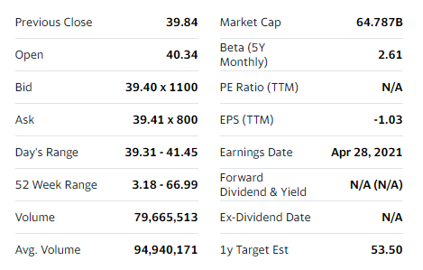
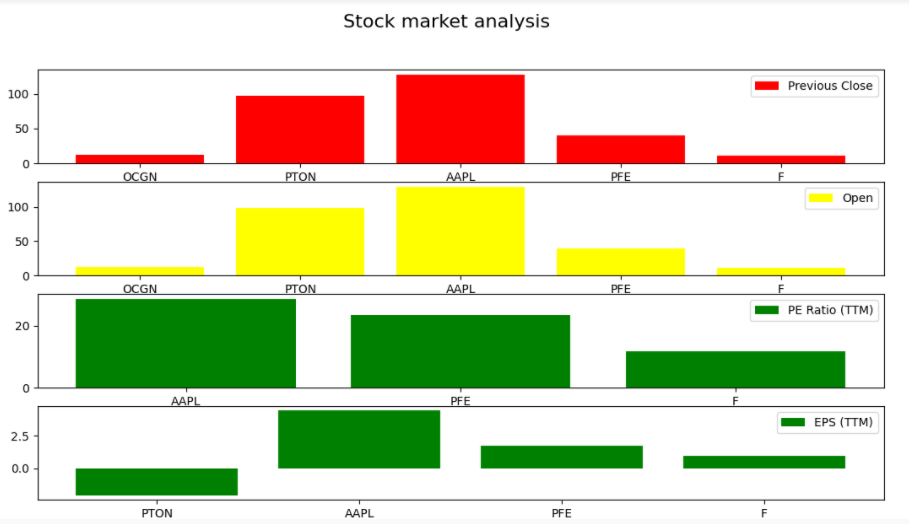

# Scraping Yahoo Finance’s most active stocks
**Subject:** Web and Social Media Scraping\
University of Warsaw, Data Science and Business Analytics Master's Degree Program in Faculty of Economic Sciences

# Introduction
We have designed mechanisms which scrap the ``most active stocks of yahoo finance`` using ``beautifulsoup``, ``scrapy``
and ``selenium`` separately. The three methods all achieve the same information. The scraped data output is later analysed,
enabling us to compare the results.\
Our way of working has a perfect collaborative and proper work on GitHub. There is a general project repository and
project developed by cloning the forked project in our accounts from the main repository and creating pull requests
with descriptive commit messages. You can track the commit history to observe how this project developed in here.\
Please find project requirements for packages inside the ``requirements.txt``. Dependencies for creating
``virtual environment`` described below.\
Furthermore, there is a ``Makefile`` created into the repository and processes mentioned below handled automatically:
- Creating virtual environment,
- Installing required packages from requirements.txt file,
- Clean virtual environment.

# Scraper Mechanism

## Beautiful Soup
For the BeautifulSoup part of this project, in addition to other libraries BeautifulSoup library was used.
Another python library, ``requests`` , gets the html of the webpage at url ``https://finance.yahoo.com/most-active``,
which is later parsed by BeautifulSoup.\ 
The webpage has a table with 24 rows and numerous columns. Every row has the **symbol** attribute,
which is later used finding the links to the company’s yahoo-finance page. 

> **"https://finance.yahoo.com/quote/" + symbol + "?p=" + symbol**

For every link defined in such a way, first the html copy of the page via the link is requested and then parsed.
The variables such as ``Previous Close``, ``Open``, etc are distributed among two tables: table 1 and table 2.
Within their respective tables, every variable is specified by ``data-test`` attribute,
allowing us to specify and extract a variable of interest one at a time.\ 
The extracted values are appended to already created lists, finally making up a dataframe with the variable names
as column headers and the values as a column vector. The dataframe is exported to the ``csv`` file **stocks_bs.csv**. 

## Scrapy
For the puropse of scraping Yahoo Finance web page, we also used Scrapy framework. The process could be divided into two parts: first - scraping the links for each of the "Most Active" companies and the second - scraping data for each of the companies.

Links creation happens similarily to the Beautiful Soup and Selenium part of the project. The links are created by adding to a base link the ending specified for each company. To extract them, we used selectors, specifically Xpaths. 
The scrapping happens with the use of spiders, first spider is created for the purpose of extracting the links and the second one to get the data dor each company. Spiders are basically a programs downloading the content of a given pages, they are using a parse function which is called when the URL is crawled and it includes the extraction logic. As not all the information about the companies could be extracted using the same xpath, we used two diffrent xpaths.

The data in our project is stored in a csv files. This is specified by the FEED_FORMAT = 'csv'. What is important to note is that, to run the spiders, a USER_AGENT = 'Mozilla/5.0 (compatible; Googlebot/2.1; +http://google.com/bot.html)' has to be used.

## Selenium
For selenium scraper, a driver for ``Mozilla Firefox`` was used. Python script is using **command line arguments**
to get input from the users. There are ``3`` command lines arguments in the python script.
1. **Flag (--watchlist):** This flag is a ``boolean variable``, it is ``not required`` and its default value is ``False``.\
   Aim of this flag is to give opportunity to scrape data from user’s own watchlist in yahoo finance website.\
   For this purpose, users should have a favourite list with a ``My Watchlist`` name that stores their favourite companies.\
   Thanks to this list, users are able to monitor stock price information about their favourite companies easily.\
   If users have a list named **My Watchlist** in yahoo finance page, they are able to input this flag as ``True``.\
   Thanks to this flag, selenium proceeds the scraping mechanism starting with a ``login`` process and
   going into a favourite list named **My Watchlist**.\
   Furthermore,
   - Selenium bot opens every single company link in this favourite list one by one in a new tab 
   - Scrape data inside the new tab 
   - Save scraped data into a dictionary of lists
   - Close new tab
   - Open another company page in a new tab… This process continue till the last company data scraped and
     saved into the dictionary. After that, selenium bot terminates itself and scraped data in dictionary converted
     as ``pandas dataframe``, finally all scraped data is saved into a ``csv`` file into the project root directory.
     
2. **Flag (--email):** This flag is used for ``watchlist`` scraping mechanism. **--email** flag is ``not required`` and
   its default value is ``None``. This is another opportunity for users who want to ``input email addresses``
   before selenium bot start. Thanks to this, users can input their email address safely and get the output faster.

3. **Flag (--passwd):** This flag is used for ``watchlist`` scraping mechanism. **--passwd** flag is ``not required`` and
   its default value is ``None``. This is another opportunity for users who want to ``input passwords`` before selenium
   starts. Thanks to this, users can input their password safely and get the output faster than input during selenium running.

*Please mind, ``--watchlist``, ``--email`` and ``--passed`` flags are ``not required`` to scrape data.
If users do not prefer to scrape data from ``watchlist``, the program automatically proceeds the same process to
scrape data from ``Stocks:Most Active`` page under the **Markets** tab*   

> Here is the correct way of flag usage to scrape data from “My Watchlist” list:
```bash
# Regular Scraper for Stocks: Most Active page.
…. : ~<project_root>$ python3 selenium_scraper.py
# Optional Scraper for favourite list named “My Watchlist”
…. : ~<project_root>$ python3 selenium_scraper.py --watchlist True --email “abc.def@uw.edu.pl” --passwd “abcdef123.”
```

*(Please mind, if users prefer a different name for a ``favourite company list`` name, they can only hardcode
the name of the list into a python script. Secondly, users are able to optimize the ``sleep times`` based on
their computer capacity. Because, response times may vary for different computers. So, if you have no output from,
the ``Selenium scraper``, please __update the sleep times__ inside the python script by hand.)*

# Technical Description of Output
For all “**Beautiful Soup**”, “**Scrapy**” and “**Selenium**” scrapers, scraped data from the yahoo finance page is
stored in a ``csv`` file. **``Schema``** for all scraper output is __exactly the same in each other__.
There are ``16 columns`` in the output file.\
Please observe a sample table for scraped data from every single company in the ``Stocks: Most Actives`` page
(or ``My Watchlist``, if __--watchlist__ is ``True`` for selenium) below.


``Company names``, and the ``values`` inside the features in the output file __may be different for all scrapers__,
because output depends on:
- ``The time`` when scraper scripts run and generate the output file,
- ``The domain`` (may different county domains used),
- ``Values`` inside the table that scrapers scrape data (if values have different type or tag/class name inside the html,
  scraper may pass this company).
  
As a result of the points above, it is __not guaranteed that every single output file generated  from scrapers will be the same__,
because yahoo finance is a ``dynamic website``. On the other hand, it is __guaranteed that every single output file
generated from the scrapers have exactly the same output schema__ based on the features that mentioned above.\
All scrapers scrape the same information but not the same value. So this situation is __not contradicted__ by the
project goal that ``All scrapers should scrape the same information from the domain of your choice``.

# Elementary Data Analysis
Aim of this elementary data analysis is to show collected data can be used for further
analysis, but nothing more detailed.\
The ``analysisbs.py`` file presents the bar graphs for 4 of the numerical columns.
The number of companies is limited to 5 for clearer presentation.\



# Labour Division

| Task           | Contributors              |
|----------------|---------------------------|
| Beautiful Soup | Tesfahun                  |
| Scrapy         | Anna                      |
| Selenium       | Alparslan                 |
| Github         | Tesfahun, Anna, Alparslan |
| Project Report | Tesfahun, Anna, Alparslan |

# Group Members


## Virtual Environment with Project Requirements
> ``Python 3.9.0`` was used to develop for this project. Please mind, python version before you create virtual environment\
> You can find the required python packages and their versions in ``requirements.txt`` file.\
> Thanks to ``Makefile``, you can create a virtual environment, install required packages and delete virtual environment automatically.
> If you do not want to use virtual environment, then you should install required packages in your base python interpreter.
> * make ``venv`` creates python virtual environment.
> * make ``require`` install required packages.
> * make ``clean`` delete venv file.

You can simply run the code like as follows from command line:
```console
**LINUX**
## For linux, you need to update the makefile commands compatible for linux environment.
...@...:project_root$ make venv
...@...:project_root$ make require
...@...:project_root$ python3 some_file_1.py
...@...:project_root$ python3 some_file_2.py

**WINDOWS**
project_root> make venv
project_root> make require
project_root> python some_file_1.py
project_root> python some_file_2.py
```
If you face problem about creating virtual environment from ``Makefile``, you can create virtual environment manually and
install packages from ``requirements.txt`` file.
   
